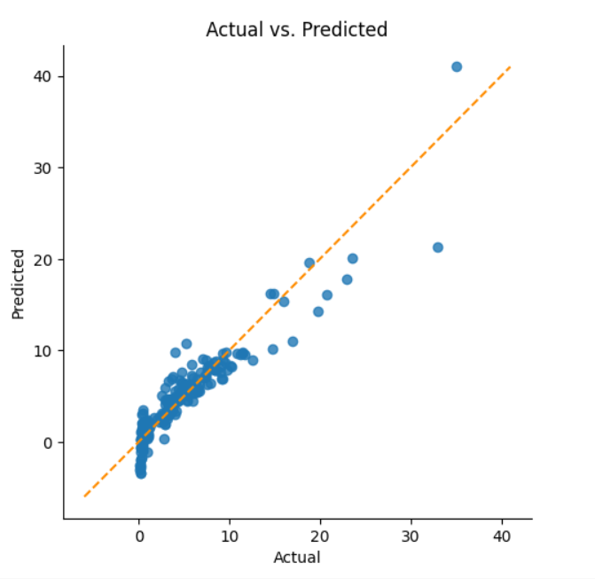

# Car-Price-Prediction-using-Linear-Regression-Insights-from-Car-Dekho-s-Sales-Data

## Introduction
This repository contains code and documentation for the Car Price Prediction using Linear Regression project. The project aims to build a linear regression model to predict the selling price of cars based on various features.

## Skills/Concepts Developed
- Python programming
- Machine learning fundamentals
- Linear regression modeling
- Exploratory data analysis
- Feature engineering

## Problem Statement
The CarDekho company maintains a database of the cars sold through their platform. The goal is to build a linear regression model to predict the selling price of cars based on features such as car name, year, present price, kilometers driven, fuel type, seller type, transmission, and owner.

## Modeling
- Read the cars dataset.
- Exploratory data analysis (EDA) to check data quality and treat missing values.
- Transform categorical data using one-hot encoding.
- Apply multiple linear regression model.
- Print the model results and evaluate performance metrics.
- ## Steps
- **Read the cars dataset.**
- 
  Check info
  .

  There it is No null values,
  301 Rows 9 Columns  

## Visualization
- Visualize diagnostic plots to assess model performance.

## Conclusion
The project successfully built a linear regression model to predict car prices with an R-squared value of > 0.8, indicating a good fit to the data.

## Recommendations
- Further feature engineering may improve model performance.
- Consider incorporating additional data sources for more accurate predictions.

## How to Use
1. Clone the repository to your local machine.
2. Install the necessary dependencies (e.g., Python, pandas, scikit-learn).
3. Run the provided Jupyter Notebook or Python script to execute the code.
4. Follow the instructions within the notebook/script to analyze the data and train the model.

## Credits
- The dataset used in this project is provided by CarDekho.
- Inspiration for modeling techniques and data analysis methods comes from various online resources and educational materials.

## About the Author
[P.Prakash] is a data science enthusiast with a passion for building predictive models and extracting insights from data. Feel free to reach out for any questions or collaborations[prakash2822001@gmail.com].
